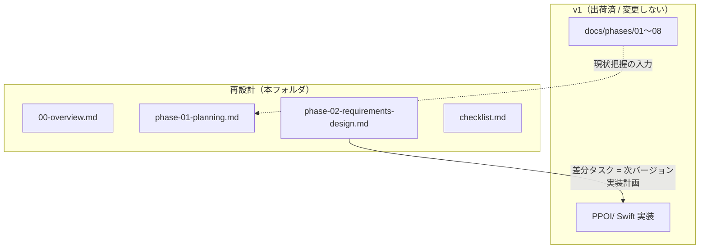

# 再設計 — 全体像と再設計ゴール

> 添付資料「iOSアプリ開発 完全ガイド」（Phase 01〜08）のフレームに沿って、PPOI（っぽい格言）を企画・要件定義段階からゼロベースで再設計する。
> 本フォルダ `docs/redesign/` は、出荷済み v1（`docs/phases/`）とは独立した「再設計版」の検討記録である。

## 1. 再設計の目的

- v1 は MVP 実装が完了し App Store 審査段階まで到達済み（`docs/phases/00-development-process.md`）。一方で v1 の企画・要件文書（`docs/phases/01-requirements.md` 他）は一問一答の確定記録であり、ペルソナ・競合調査・画面遷移図・データモデル図・WBS・ASO 戦略など**汎用ガイドが求める網羅項目が不足**している。
- 本再設計では製品コンセプトを**ゼロベースで再検討**し、各論点で「v1 現状 → 課題 → 選択肢 → 推奨」を明示する。実装方針が変わりうる箇所を明確にフラグする。
- ゴールは「次バージョン（v1.1 / v2）に向けた、ガイド準拠の企画・要件・設計ドキュメント一式」を整えること。

## 2. スコープ

| 区分 | 内容 |
|------|------|
| 本再設計で扱う | Phase 01 企画・アイデア、Phase 02 要件定義・設計（中心）。Phase 03〜08 はチェックリストで観点を整理 |
| 本再設計で扱わない | `PPOI/` 配下の Swift 実装、`functions/` の変更（実装差分は Phase 02 の WBS に洗い出すのみ） |
| 既存 v1 文書 | `docs/phases/01〜08` は**変更せず保持**（v1 の確定記録として残す） |

## 3. 開発フロー全体像（ガイド準拠）

| Phase | 名称 | 主な成果物 | 再設計での扱い |
|-------|------|-----------|----------------|
| 01 | 企画・アイデア | ターゲット/課題/競合/収益/MVP | `phase-01-planning.md`（中心） |
| 02 | 要件定義・設計 | 機能要件/画面一覧/遷移図/データモデル/API/WBS | `phase-02-requirements-design.md`（中心） |
| 03 | 環境構築 | Xcode/Bundle ID/SPM | v1 で構築済（`docs/phases/05-project-setup.md`） |
| 04 | UI/UX デザイン | ワイヤー/モック/HIG 準拠 | v1 設計あり（`docs/phases/03-ui-design.md`） |
| 05 | 開発・コーディング | SwiftUI 実装/アーキテクチャ | v1 実装済（`PPOI/`） |
| 06 | テスト・デバッグ | Unit/UI/TestFlight | v1 実施済（`docs/phases/07-testing-checklist.md`） |
| 07 | App Store 審査・申請 | スクショ/メタデータ/審査 | v1 進行中（`docs/phases/08-app-store-release.md`） |
| 08 | リリース・運用・改善 | ASO/分析/アップデート | `checklist.md` で観点整理 |

## 4. v1（出荷版）との関係

- 再設計は v1 を**否定するものではなく**、v1 を起点に「次に何を足す/変える/やめるか」を体系的に整理する。
- 各 doc 内で v1 と相違する判断には「v1 → 再設計案」の形で差分を明記する。

## 5. 関連ドキュメント

| ファイル | 内容 |
|----------|------|
| `phase-01-planning.md` | 企画・アイデア（ペルソナ/課題/競合/収益/MVP） |
| `phase-02-requirements-design.md` | 要件定義・設計（機能要件/画面/遷移図/データモデル/API/WBS） |
| `checklist.md` | 開発リリースチェックリスト（Phase 01〜08） |
| `docs/phases/`（v1） | 出荷版の確定記録（参照のみ） |

## 6. 決定の確定ルール

- 収益モデル・スコープなど方向性に関わる論点は、各 doc に「選択肢 + 推奨」を提示する形で記述する。
- **最終決定はユーザー承認をもって確定**とし、確定後に該当 doc の「決定」欄を更新する。

## 変更履歴

| 日付 | 内容 |
|------|------|
| 2026-05-31 | 再設計フォルダ作成・全体像ドキュメント作成 |
