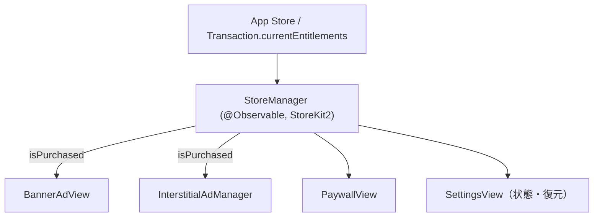
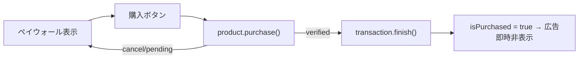

# v2.0 詳細設計 — 買い切り課金（W5〜W8）

> Phase 01 で承認した収益モデル D 案（買い切り、¥400 初期値）。StoreKit 2 でローカル検証する非消費型プロダクト。
> 解放内容: **広告除去 + 全機能**（将来のテーマ拡張・お気に入り強化を含む）。サブスクではない。

## プロダクト

| 項目 | 値 |
|------|----|
| Product ID | `com.takahiro.ppoi.premium` |
| タイプ | 非消費型（NonConsumable） |
| 価格 | ¥400（Tier、ASC で設定。市場検証で見直し） |
| 解放 | バナー/インタースティシャル広告の除去、全機能 |

## アーキテクチャ

- `StoreManager.shared`（`@MainActor @Observable`）が単一の真実源。
- 起動時に `Transaction.updates` を購読し、`currentEntitlements` から `isPurchased` を導出。
- 広告は `isPurchased` を見て出し分け（バナーは非表示、インタースティシャルは早期 return）。

## 追加・変更ファイル

| ファイル | 役割 |
|----------|------|
| `PPOI/Core/Purchase/StoreManager.swift` | 商品ロード/購入/復元/権利状態 |
| `PPOI/Features/Purchase/PaywallView.swift` | 課金訴求・購入・復元 |
| `PPOI/Features/Ads/BannerAdView.swift` | 購入時は非表示 |
| `PPOI/Features/Ads/InterstitialAdManager.swift` | 購入時は表示しない |
| `PPOI/App/RootView.swift` | StoreManager を環境注入・起動 |
| `PPOI/Features/Settings/SettingsView.swift` | プレミアム状態・購入/復元導線 |
| `PPOI.storekit` | ローカルテスト用 StoreKit 設定（scheme 連携） |
| `project.yml` | scheme に storeKitConfiguration を設定 |

## 購入フロー

- 復元: `AppStore.sync()` → `currentEntitlements` 再評価。

## 必要な手動設定（Mac / Apple Developer）

1. App Store Connect で非消費型 IAP `com.takahiro.ppoi.premium`（¥400）を作成・審査用メタデータ登録。
2. `xcodegen generate` → scheme に `PPOI.storekit` がローカルテスト用として設定される。
3. Sandbox / StoreKit テストで購入・復元・広告非表示を確認。
4. 審査提出時に IAP のスクショ・説明を添付。

## テスト観点（QA連携）

- 未購入: バナー表示・共有後インタースティシャル表示。
- 購入直後: バナー消失・インタースティシャル抑止。
- 復元: 別端末/再インストールで `restore()` 後にプレミアム化。
- キャンセル/保留時にクラッシュや誤課金フラグが立たない。
- ネット不通時の商品ロード失敗のハンドリング表示。

## 変更履歴

| 日付 | 内容 |
|------|------|
| 2026-06-01 | v2.0 買い切り課金設計作成（StoreKit2・W5〜W8） |
