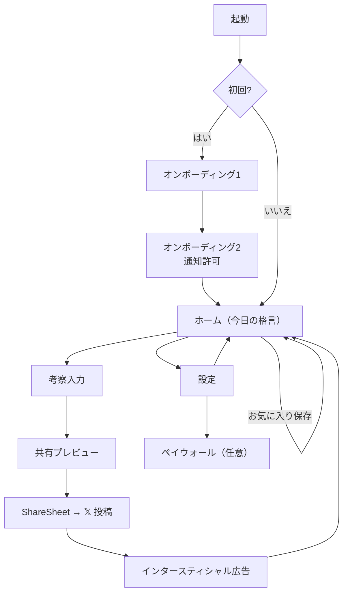
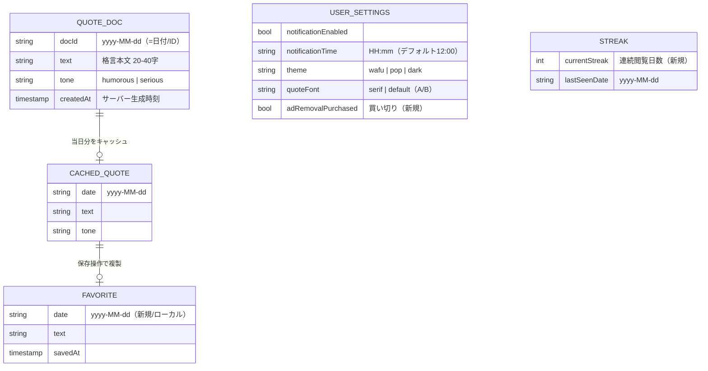
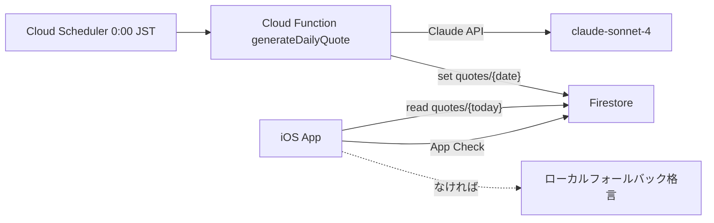

# Phase 02 — 要件定義・設計（再設計）

> ガイド Phase 02 準拠：機能要件リスト → 画面一覧 → 画面遷移図 → データモデル設計 → API 設計 → WBS。
> Phase 01（`phase-01-planning.md`）の再設計 MVP を入力とする。優先度は High（Must）/ Med（Should）/ Low（任意）。

## 1. 機能要件リスト（「〜できる」形式）

| ID | 機能要件 | 優先度 | v1 | 備考 |
|----|----------|--------|----|------|
| FR-01 | ユーザーは今日の格言を1件閲覧できる | High | 実装済 | 日付ベース・全員同期 |
| FR-02 | ユーザーは当日分のみ閲覧でき、過去は見られない | High | 実装済 | プレミア感の核 |
| FR-03 | 取得済みの当日格言は電波がなくても閲覧できる | High | 実装済 | UserDefaults キャッシュ |
| FR-04 | ユーザーは考察テキストを任意入力できる | High | 実装済 | 空でも共有可 |
| FR-05 | ユーザーは格言+考察+日付の共有画像を生成できる | High | 実装済 | 1200×675 |
| FR-06 | ユーザーは共有画像を𝕏等へ ShareSheet で投稿できる | High | 実装済 | |
| FR-07 | ユーザーはテーマを3種から選択できる | High | 実装済 | 和風/ポップ/ダーク |
| FR-08 | ユーザーは通知のON/OFFと時刻を設定できる | High | 実装済 | デフォルト12:00 |
| FR-09 | 格言が「創作（っぽい格言）」であると明示される | High | 暗黙 | **新規**。誤認防止（UI+共有画像） |
| FR-10 | ユーザーは格言本文の字体をA/Bで切替できる | Med | 一部 | serif / default |
| FR-11 | ユーザーは当日の格言をお気に入り保存できる | Med | 未 | **新規**。ローカルのみ |
| FR-12 | ユーザーは連続閲覧日数（ストリーク）を確認できる | Med | 未 | **新規**。再訪動機 |
| FR-13 | ユーザーはホーム画面ウィジェットで今日の格言を見られる | Med | 未 | **新規**。WidgetKit |
| FR-14 | ユーザーは買い切り課金で広告除去+全機能解放できる | Med | 未 | **新規**。§Phase01-4 承認時 |
| FR-15 | アプリ下部にバナー広告が表示される | High | 実装済 | 課金時は非表示 |
| FR-16 | 𝕏共有後にインタースティシャル広告が表示される | High | 実装済 | 課金時は非表示 |
| FR-17 | 初回起動時にオンボーディング2画面が表示される | High | 実装済 | 説明+通知許可 |
| FR-18 | サーバーが毎日0:00 JSTに格言を生成・配信する | High | 実装済 | Cloud Functions + Claude |

## 2. 画面一覧（スクリーンリスト）

| 画面 | 役割 | 主な要素 | 優先度 |
|------|------|----------|--------|
| オンボーディング1 | 「今日だけの格言」説明 | 見出し/本文/テーマプレビュー/次へ | High |
| オンボーディング2 | 「考察してシェア」説明 + 通知許可 | 見出し/共有イメージ/通知許可CTA | High |
| ホーム（今日の格言） | 当日格言の表示と共有起点 | 格言本文/日付/創作明示/考察シェアボタン/お気に入り/ストリーク/バナー | High |
| 考察入力 | 考察テキスト入力 | テキスト入力/プレビューへ | High |
| 共有プレビュー | 共有画像の確認と投稿 | カード画像/ShareSheet起動 | High |
| 設定 | 各種設定 | 通知ON/OFF・時刻/テーマ3択/字体A/B/（課金）/プライバシー・規約リンク | High |
| ペイウォール（任意） | 買い切り課金導線 | 解放内容/価格/購入・復元 | Med |

- タブバーなし（最小構成）の方針は維持。

## 3. 画面遷移図

## 4. データモデル設計

- **Firestore**: `quotes/{yyyy-MM-dd}`（読み取り専用、全ユーザー同期）。実装は `functions/src/generateQuote.ts` と一致（`text` / `tone` / `createdAt`）。
- **ローカル（UserDefaults）**: 設定・当日キャッシュ。再設計で追加する Favorite / Streak もローカル保持（当日限定の世界観・サーバーコスト最小を維持）。

## 5. API・バックエンド設計

| 項目 | 内容 |
|------|------|
| データソース | Firebase Firestore `quotes/{date}` |
| 取得 | クライアントは `today(JST)` のドキュメントを read。なければフォールバック格言を表示 |
| 生成 | Cloud Functions（毎日0:00 JST スケジュール）が Claude `claude-sonnet-4-20250514` で生成し書き込み |
| トーン制御 | 直近7日の `tone` 比率を見て偏り防止（`pickTone`） |
| 認証/保護 | Firebase App Check（クライアント検証）、Firestore ルールで read-only |
| 課金（新規） | StoreKit 2 ローカル検証（買い切り、サーバー不要） |
| 広告 | AdMob（バナー/インタースティシャル）。課金フラグで非表示制御 |

## 6. WBS / 差分スケジュール（次バージョン実装計画）

> v1 実装済を除く、再設計で**新規/変更**となるタスクのみ。工数は目安（個人開発・相対）。

| # | タスク | 関連FR | 規模 | 依存 |
|---|--------|--------|------|------|
| W1 | 共有画像とUIに「っぽい格言（創作）」明示を追加 | FR-09 | S | ShareImageRenderer |
| W2 | お気に入り保存（ローカル）モデル+UI | FR-11 | M | UserDefaultsStore |
| W3 | ストリーク計測ロジック+ホーム表示 | FR-12 | M | 起動時判定 |
| W4 | WidgetKit ウィジェット（今日の格言） | FR-13 | L | App Group 共有 |
| W5 | StoreKit 2 買い切り（広告除去+全機能） | FR-14 | L | ペイウォール画面 |
| W6 | 課金フラグによる広告非表示制御 | FR-14,15,16 | S | W5 |
| W7 | ペイウォール画面 | FR-14 | M | W5 |
| W8 | 設定画面に課金/復元導線追加 | FR-14 | S | W5 |

### 推奨リリース分割
- **v1.1**: W1（創作明示・誤認防止）+ W2（お気に入り）+ W3（ストリーク）— 低リスクで体験強化。
- **v1.2**: W4（ウィジェット）— 流入・想起強化。
- **v2.0**: W5〜W8（課金）— 収益化。§Phase01-4 の承認後に着手。

## 7. 確定事項・残課題

確定（2026-05-31、`phase-01-planning.md` 参照）:
- 収益モデル: **買い切りD案**を v2.0 で導入（¥400 初期値）。v1.1/v1.2 は広告のみ。
- リリース分割: **v1.1 = W1+W2+W3** / v1.2 = W4 / v2.0 = W5〜W8。

残課題（Phase 04 UI 設計で詰める）:
- お気に入り/ストリークを「当日限定の世界観」と両立させる UI 詳細。
- 「創作明示」の文言・配置（共有画像内/オンボーディング/ホーム）。

> v1.1 の詳細設計は [`v1.1-design.md`](v1.1-design.md) を参照。

## 変更履歴

| 日付 | 内容 |
|------|------|
| 2026-05-31 | Phase 02 再設計ドキュメント作成（機能要件18件/画面一覧/遷移図/ER図/API/WBS） |
