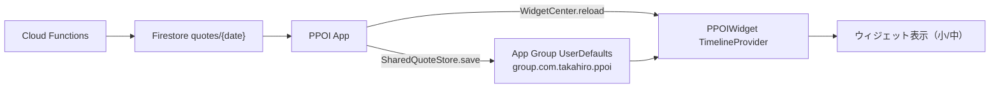

# v1.2 詳細設計 — 今日の格言ウィジェット（W4）

> Phase 02 WBS の W4。ホーム画面ウィジェットで「今日の格言」を表示し、再訪・想起を促す。
> 既存のセキュア格言キャッシュ（Keychain+AES）はアプリ専用のため、ウィジェット共有用に **App Group の共有ストア（平文）** を別途用意する。格言は全ユーザー公開コンテンツのため平文で問題なし。考察テキスト等の私的データは共有しない。

## 方針

- データ供給はサーバー直アクセスせず、**アプリが取得済みの今日の格言を App Group 経由でウィジェットへ渡す**（Firebase をウィジェットに同梱しない＝軽量）。
- タイムラインは **次の JST 0:00 で更新**（日替わり）。アプリ起動・格言取得時にも `WidgetCenter` でリロード。

## アーキテクチャ

## 追加・変更ファイル

| ファイル | 役割 |
|----------|------|
| `PPOI/Core/Persistence/SharedQuoteStore.swift` | App Group 共有ストア（アプリ・ウィジェット双方が利用） |
| `PPOI/Features/Quote/QuoteViewModel.swift` | 取得時に共有ストアへ保存し WidgetCenter をリロード |
| `PPOIWidget/PPOIWidget.swift` | ウィジェット本体（Provider + View + Bundle） |
| `PPOIWidget/Info.plist` | WidgetKit 拡張ポイント宣言 |
| `PPOIWidget/PPOIWidget.entitlements` | App Group |
| `PPOI/Resources/PPOI.entitlements` | App Group（アプリ側） |
| `project.yml` | 拡張ターゲット追加・App Group エンタイトルメント |

## 共有ストア仕様

- App Group ID: `group.com.takahiro.ppoi`
- 保存内容: `{ date: "yyyy-MM-dd", text: String }`（格言本文のみ）
- 保存タイミング: `QuoteViewModel.loadQuote` で今日の格言確定後。
- 保存後 `WidgetCenter.shared.reloadAllTimelines()`。

## ウィジェット仕様

- 種類: `StaticConfiguration`、対応サイズ `systemSmall` / `systemMedium`。
- 表示: 日付（小さく）＋格言本文。背景は `containerBackground`（iOS 17+）。
- タイムライン: 現在エントリ1件 + `.after(次のJST 0:00)` で再読込。共有ストアが空ならプレビュー格言。
- データなし時: 「アプリを開いて今日の一句を受け取ろう」を表示。

## 必要な手動設定（Mac / Apple Developer）

1. Apple Developer の App ID に **App Groups** ケイパビリティを有効化し、`group.com.takahiro.ppoi` を作成。
2. Xcode（自動署名）で App / Widget 両ターゲットに App Group を割当（`xcodegen generate` 後）。
3. `xcodegen generate` → ビルド → 実機でウィジェット追加確認。

## テスト観点（QA連携）

- 当日格言取得後、ウィジェットが当日の内容へ更新される。
- 日替わり（JST 0:00 跨ぎ）でタイムラインが更新される。
- 共有ストア未書込時（初回・未起動）にプレースホルダ表示。
- 小/中サイズでレイアウト崩れなし。長文格言の折返し。

## 変更履歴

| 日付 | 内容 |
|------|------|
| 2026-06-01 | v1.2 ウィジェット設計作成（App Group 共有方式・W4） |
